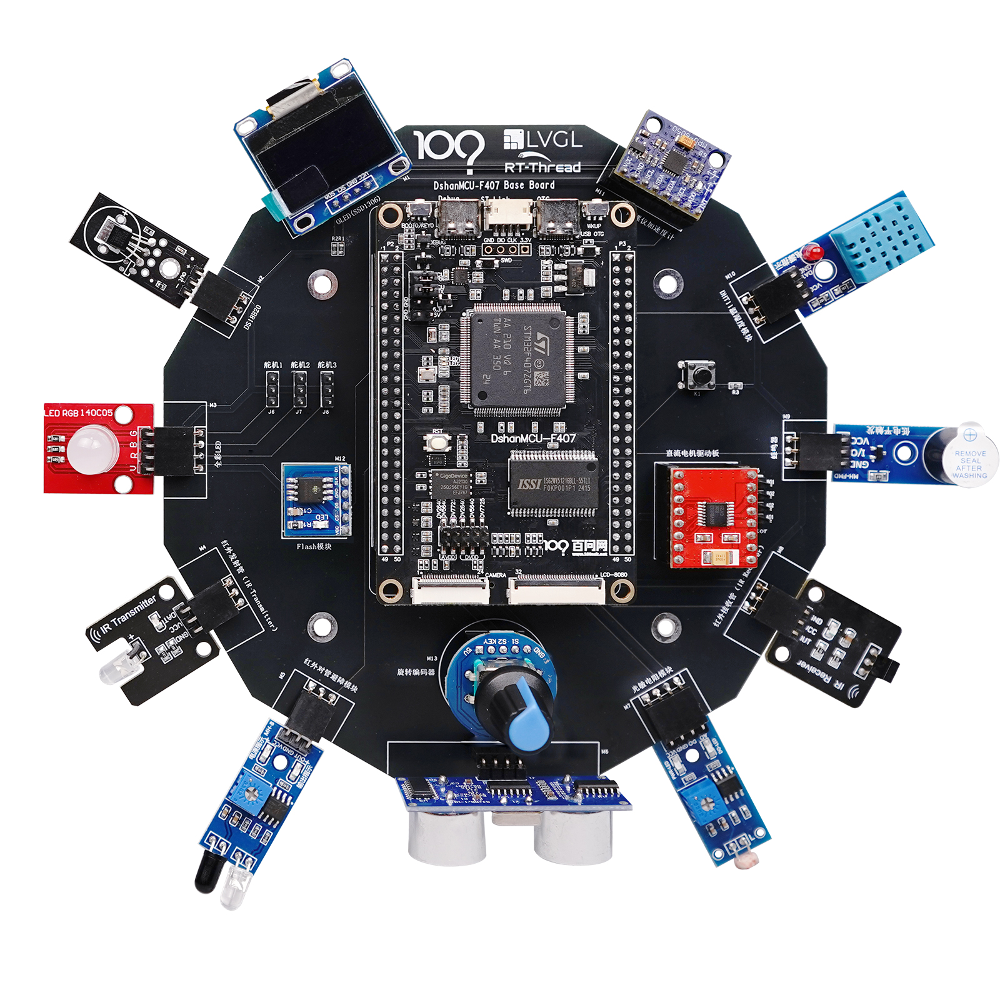

=============================
🎫STM32F407_瑞士军刀开发板
=============================

1. 资料下载
##########################

1.1 学习路线
*****************************
详细学习路线请参考下方文档站点：

- https://100ask.net/hardware

1.2 开发板配套资料
*****************************

- ``百度云网盘`` ：https://pan.baidu.com/s/1xA8NuHYCAMf29jlFRF22FQ?pwd=root 密码：root

2. 产品图片
##########################

- DShanMCU-F407 开发板主图如下所示

    DShanMCU-F407 开发板实物图正面

.. _DShanMCU-F407 开发板实物图正面: https://item.taobao.com/item.htm?id=830887560871

3. 购买方式
##########################

- 开发板：

  - 天猫：https://detail.tmall.com/item.htm?abbucket=13&id=830932718380
  
  - 淘宝：https://item.taobao.com/item.htm?id=830887560871

- 视频：

  - 淘宝：http://100ask.taoboa.com
  
  - 天猫：http://weidongshan.tmall.com
  
  - 官网：http://www.100ask.net
  
  - 微信小程序或APP学习
  
  .. figure:: http://photos.100ask.net/100ask/aboutus/100ASK_Applets.jpg
  
  

4. 交流答疑
##########################

- 售前问题：

  - 淘宝 https://100ask.taobao.com 上淘宝直接一对一咨询技术
  
- 售后问题：

  - 交流社区：https://forums.100ask.net
  
- 讨论群

  - 学习交流微信群：https://100ask.net/hardware
  
  - 学习交流QQ群：  https://100ask.net/hardware

- 投诉：

  - 加微信：``13510691477``，备注：**投诉**

5. 关于百问网(韦东山)
##########################

 :doc:`/AboutUs/aboutus/index`

